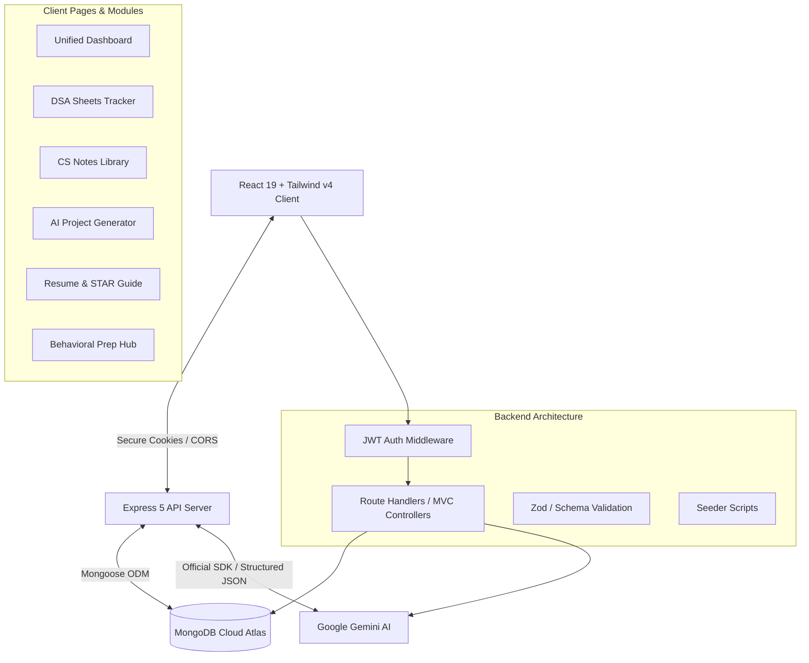

# PrepStack 🚀 <!-- omit in toc -->

[](LICENSE)
[](https://github.com/SahilSameer18/prepstack/pulls)
[](https://react.dev/)
[](https://tailwindcss.com/)
[](https://expressjs.com/)
[](https://ai.google.dev/)

PrepStack is a premium, full-stack SDE interview preparation ecosystem. It synthesizes **AI-driven project generation**, **curated DSA progress tracking**, **academic CS notes**, and **behavioral/STAR resume preparation templates** into a single, high-performance platform.

Designed to showcase **modern software engineering practices**, PrepStack bridges the gap between raw candidate skills and recruiter expectations by showcasing production-ready architecture, structured GenAI pipelines, and secure session state.

---

## 📋 Table of Contents <!-- omit in toc -->
- [🎯 The Problem PrepStack Solves](#-the-problem-prepstack-solves)
- [⚡ High-Yield Technical Highlights (For Recruiters)](#-high-yield-technical-highlights-for-recruiters)
- [🏗️ Architectural Blueprint](#️-architectural-blueprint)
- [✨ Core Features \& Business Value](#-core-features--business-value)
  - [🤖 AI-Powered Project Generation](#-ai-powered-project-generation)
  - [📈 Dynamic DSA Trackers](#-dynamic-dsa-trackers)
  - [📚 CS Core Fundamentals Library](#-cs-core-fundamentals-library)
  - [📝 STAR Resume \& Behavioral Console](#-star-resume--behavioral-console)
- [🛠️ Deep-Dive Tech Stack](#️-deep-dive-tech-stack)
- [💾 Database Schema ERD](#-database-schema-erd)
- [🔗 API Endpoint Reference](#-api-endpoint-reference)
- [🚀 Local Installation \& Seeding Guide](#-local-installation--seeding-guide)
  - [1. Clone Repository](#1-clone-repository)
  - [2. Backend Setup](#2-backend-setup)
  - [3. Frontend Setup](#3-frontend-setup)
  - [4. Seed Mock Data](#4-seed-mock-data)
- [💼 Available Scripts](#-available-scripts)
- [🤝 Contributing](#-contributing)
- [📄 License](#-license)

---

## 🎯 The Problem PrepStack Solves

Candidates typically scatter their preparation across multiple platforms: LeetCode for DSA, random blog posts for CS theory, ChatGPT for generic project descriptions, and various PDFs for resume tips.

PrepStack centralizes and streamlines the entire workflow:
1. **Generates unique, startup-level project ideas** using AI, outputting structured tech stacks and recruiter-tailored "resume impact points."
2. **Tracks problem-solving progress** across curated, industry-standard sheets (Striver A2Z, Blind75, NeetCode, LoveBabbar) in one clean database.
3. **Prepares candidates for the HR/Behavioral round** using interactive STAR (Situation, Task, Action, Result) response templates and strategic examples.

---

## ⚡ High-Yield Technical Highlights (For Recruiters)

This codebase is crafted to demonstrate production-ready design patterns and high-quality software craftsmanship:

*   **Type-Safe, Structured GenAI Outputs:** Rather than raw unstructured string parsing, the backend integrates the official `@google/genai` SDK and utilizes `zod-to-json-schema` to enforce type-safe JSON returns. The model outputs strictly conform to a structured Mongoose validation schema.
*   **Cutting-Edge Stack & Tools:** Built using the latest **React 19** (concurrent rendering, cleaner hooks) and **Vite 7**, backed by **Tailwind CSS v4**'s advanced compiler, and powered by **Express 5** (optimized route-level error handling).
*   **High Performance UX:** Implements route-based code splitting using React's **`lazy()` API** and suspense boundaries, reducing initial bundle weight and maximizing Lighthouse performance metrics. Smooth fluid motion is powered by **Framer Motion 12**.
*   **State-of-the-Art Authentication:** Implements secure JWT session management via **HTTP-only SameSite cookies**, preventing CSRF/XSS vectors. It integrates a token blacklisting model on the database to handle absolute, stateless logouts.
*   **Robust Database Seeding Infrastructure:** Features a robust database seeder pipeline (`masterSeed.js`) that uses `findOneAndUpdate` upsert logic to populate complete complex DSA sheets and CS notes schemas recursively without duplication risks.

---

## 🏗️ Architectural Blueprint

PrepStack is designed as a clean two-tier decoupled architecture:



---

## ✨ Core Features & Business Value

### 🤖 AI-Powered Project Generation
*   **Dynamic Prompting:** Candidates supply their target technology stack, project complexity (Easy/Medium/Hard), specific domains (FinTech, EdTech, Web3, HealthTech), and custom project notes.
*   **Actionable Recruiter Bulletpoints:** Gemini generates detailed features, exact step-by-step tech implementations, and **direct STAR bullet points for the user's resume**, explaining why the project will stand out to hiring managers.
*   **Persistence:** Saved ideas are linked to user accounts for continuous reference or deletion.

### 📈 Dynamic DSA Trackers
*   Centralizes popular lists: **Blind 75**, **NeetCode**, **Striver A2Z**, and **Love Babbar**.
*   Tracks solved problems asynchronously, updating progress metrics on the unified dashboard instantly.
*   Problems are categorized by topics (e.g., Arrays, Graphs, Dynamic Programming) with external compiler links.

### 📚 CS Core Fundamentals Library
*   Pre-seeded revision notes for core academic subjects: **Operating Systems (OS)**, **Database Management Systems (DBMS)**, **Computer Networks (CN)**, and **Object-Oriented Programming (OOP)**.
*   Structured with interactive markdown lists and optimized layouts for fast revision.

### 📝 STAR Resume & Behavioral Console
*   **Resume Guidelines:** Detailed, section-by-section breakdown of contact details, technical skills, experiences, and projects with real-world examples.
*   **HR Behavioral Hub:** A searchable database of behavioral questions categorized by focus area (Teamwork, Problem Solving, Leadership, Personal) offering custom expert strategies and sample answers.

---

## 🛠️ Deep-Dive Tech Stack

### Frontend Client
*   **React 19 & Vite 7:** High-speed Hot Module Replacement (HMR) and optimized compilation.
*   **Tailwind CSS v4:** Modern lightning-fast CSS utility rendering.
*   **Framer Motion 12:** Fluid animations and transitions for custom user feedback loops.
*   **React Router DOM 7:** Powerful client-side routing.
*   **Axios:** Configured interceptor instance supporting `withCredentials: true` for secure cookies.

### Backend Server
*   **Node.js & Express 5:** Streamlined middleware, unified request routing, and native promise support.
*   **Mongoose 9:** ODM layer ensuring strict data-types and flexible MongoDB indexing.
*   **Google Gemini AI SDK:** Deep integration of `@google/genai` using structured response JSON config schemas.
*   **Zod & Zod-to-Json-Schema:** Strict request parsing on incoming parameters, shared seamlessly with Gemini.
*   **Bcrypt & JWT:** Cryptographically secure password hashing and session token generation.

---

## 💾 Database Schema ERD

```
┌─────────────────────────────────┐      ┌─────────────────────────────────┐
│              User               │      │            Progress             │
├─────────────────────────────────┤      ├─────────────────────────────────┤
│ _id: ObjectId                   │◄────┐│ _id: ObjectId                   │
│ username: String (Unique)       │     ││ user: ObjectId (Ref: User)      │
│ email: String (Unique)          │     ││ sheetSlug: String               │
│ password: String (Hashed)       │     ││ solvedProblems: Array [String]  │
│ timestamps: Date                │     ││ timestamps: Date                │
└─────────────────────────────────┘     │└─────────────────────────────────┘
                                        │
┌─────────────────────────────────┐     │┌─────────────────────────────────┐
│             Project             │     ││         BlacklistedToken        │
├─────────────────────────────────┤     │├─────────────────────────────────┤
│ _id: ObjectId                   │     ││ _id: ObjectId                   │
│ user: ObjectId (Ref: User) ─────┼─────┘│ token: String                   │
│ title: String                   │      │ createdAt: Date                 │
│ tagline: String                 │      └─────────────────────────────────┘
│ description: String             │
│ features: Array [String]        │      ┌─────────────────────────────────┐
│ techStack: String               │      │            DSASheet             │
│ difficulty: String              │      ├─────────────────────────────────┤
│ estimatedTime: String           │      │ _id: ObjectId                   │
│ resumeValue: String             │      │ name: String                    │
│ domain: String                  │      │ slug: String (Unique)           │
│ timestamps: Date                │      │ description: String             │
└─────────────────────────────────┘      │ topics: Array [DSATopic]        │
                                         └─────────────────────────────────┘
```

---

## 🔗 API Endpoint Reference

### Authentication Services (`/api/auth`)
*   `POST /register` - Register a new candidate.
*   `POST /login` - Login, signs JWT, and responds with secure HTTP-only cookies.
*   `POST /logout` - Clears browser cookies and blacklists session tokens.
*   `GET /current-user` - Returns authenticated candidate profile info.

### AI Project Services (`/api/projects`)
*   `POST /generate` - Request Gemini to compose a structured project idea.
*   `GET /` - Retreive all saved project templates for the logged-in user.
*   `GET /:projectId` - Fetch specific project details.
*   `DELETE /:projectId` - Remove project from saved collection.

### DSA Sheets Services (`/api/sheets`)
*   `GET /` - List all seeded DSA tracking lists.
*   `GET /:slug` - Retrieve topics and problems within a specific sheet.
*   `GET /:slug/progress` - Fetch solved problems for the current user.
*   `POST /:slug/progress` - Toggle status (complete/incomplete) on a specific problem.

### Revision Notes Services (`/api/notes`)
*   `GET /` - List all core academic CS fundamental categories.
*   `GET /:subject` - Fetch the detailed syllabus notes of a selected subject.

---

## 🚀 Local Installation & Seeding Guide

### 1. Clone Repository
```bash
git clone https://github.com/SahilSameer18/prepstack.git
cd prepstack
```

### 2. Backend Setup
```bash
cd server
npm install
```
Create a `.env` file in the root of the `/server` directory:
```env
PORT=3000
MONGO_URI=mongodb://127.0.0.1:27017/prepstack
JWT_SECRET=your_ultra_secure_jwt_secret_key
GOOGLE_API_KEY=AIzaSyYourGeminiApiKeyHere
```
Start the local server in development mode:
```bash
npm run dev
```

### 3. Frontend Setup
In a new terminal window:
```bash
cd client
npm install
```
Start the development client:
```bash
npm run dev
```

### 4. Seed Mock Data
To populate the database with complete curricula and DSA sheets:
```bash
cd server
npm run seed:all
```

---

## 💼 Available Scripts

### Backend (`server/`)
*   `npm run dev` - Launches server with Nodemon auto-reloads.
*   `npm start` - Launches server in production mode.
*   `npm run seed:notes` - Seeds the CS notes (DBMS, CN, OS, OOPS).
*   `npm run seed:all` - Seeds all sheets (Blind75, NeetCode, Striver A2Z, LoveBabbar, CS Notes).

### Frontend (`client/`)
*   `npm run dev` - Fires up Vite dev server.
*   `npm run build` - Compiles standard production bundles.
*   `npm run lint` - Code consistency review using ESLint.
*   `npm run preview` - Locally review built production files.

---

## 🤝 Contributing

Contributions make the open-source community an amazing place to learn, inspire, and create. Any contributions you make are **greatly appreciated**.

1. Fork the Project
2. Create your Feature Branch (`git checkout -b feature/AmazingFeature`)
3. Commit your Changes (`git commit -m 'Add some AmazingFeature'`)
4. Push to the Branch (`git push origin feature/AmazingFeature`)
5. Open a Pull Request

---

## 📄 License

Distributed under the MIT License. See `LICENSE` for more information.

---

<p align="center">Made with ❤️ by Sahil Sameer and the PrepStack Team.</p>
