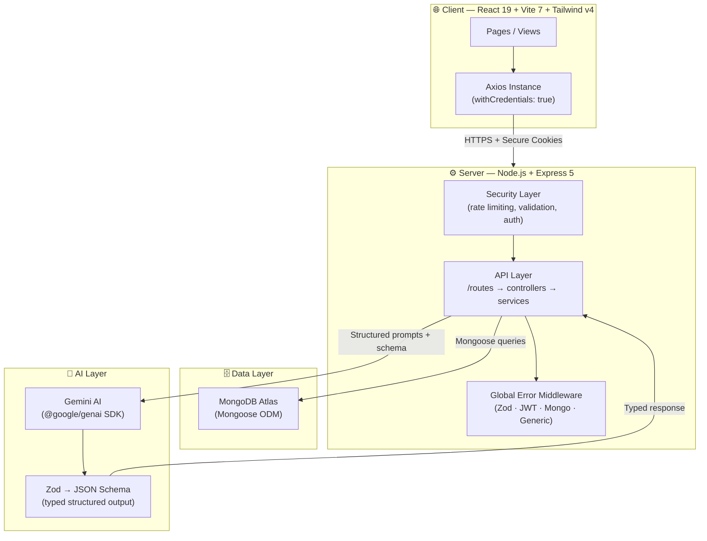
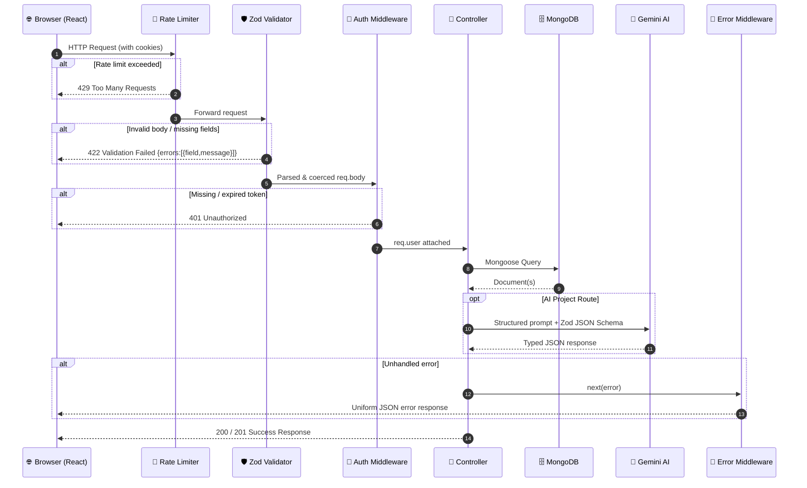
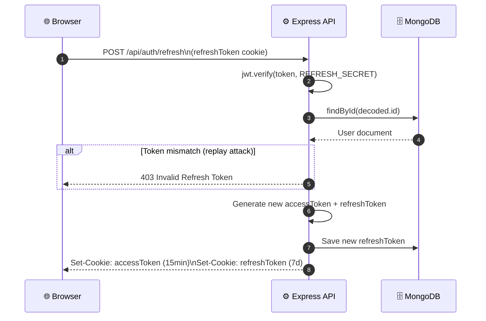
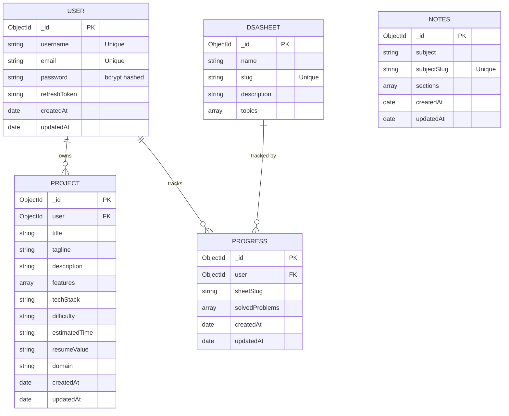

# PrepStack 🚀 <!-- omit in toc -->

<div align="center">

[](LICENSE)
[](https://github.com/SahilSameer18/prepstack/pulls)
[](https://react.dev/)
[](https://tailwindcss.com/)
[](https://expressjs.com/)
[](https://ai.google.dev/)

**A premium, full-stack SDE interview preparation ecosystem.**

[Live Demo](https://prepstack-ss.vercel.app) · [Report Bug](https://github.com/SahilSameer18/prepstack/issues) · [Request Feature](https://github.com/SahilSameer18/prepstack/issues)

</div>

---

PrepStack centralizes and optimizes the entire SDE interview preparation journey: **AI-powered project generation**, **curated DSA sheets progress tracking**, **core CS fundamentals notes**, and **behavioral interview / STAR templates**—built with production-grade fullstack architecture.

---

## 📋 Table of Contents <!-- omit in toc -->

- [🎯 The Problem PrepStack Solves](#-the-problem-prepstack-solves)
- [⚡ High-Yield Technical Highlights](#-high-yield-technical-highlights)
- [📁 Directory Structure](#-directory-structure)
- [🏗️ Architectural Blueprint](#️-architectural-blueprint)
- [✨ Core Features \& Business Value](#-core-features--business-value)
- [🛠️ Deep-Dive Tech Stack](#️-deep-dive-tech-stack)
- [💾 Database Schema ERD](#-database-schema-erd)
- [🔗 API Endpoint Reference](#-api-endpoint-reference)
- [🚀 Local Installation \& Seeding Guide](#-local-installation--seeding-guide)
- [💼 Available Scripts](#-available-scripts)
- [🤝 Contributing](#-contributing)
- [📄 License](#-license)

---

## 🎯 The Problem PrepStack Solves

Candidates typically scatter preparation workflows across multiple disconnected tools: LeetCode/CodeStudio for DSA sheets, blog posts for CS theory, general-purpose LLMs for generic project ideas, and static templates for behavioral resumes.

PrepStack centralizes the workflow:
1. **Generates unique, recruiter-ready SDE project profiles** tailored to your tech stack and domain, returning STAR-style resume bullet points via Gemini AI.
2. **Tracks problem-solving progress asynchronously** across industry-standard DSA sheets (Striver A2Z + SDE, Blind75, NeetCode, Love Babbar) in one clean dashboard.
3. **Consolidates core CS theory revisions** (OS, DBMS, Networks, OOP) and behavioral STAR strategies in an interactive hub.

---

## ⚡ High-Yield Technical Highlights

- **Type-Safe GenAI Pipeline:** Passes a schema generated by `zod-to-json-schema` directly to the Gemini AI SDK, forcing the LLM to emit strict, typed JSON without fragile parsing code.
- **Layered Request Validation:** Custom Express middleware `validate(schema)` intercepts and validates incoming HTTP requests using Zod schemas before hitting controllers, returning structured `422` field-specific errors.
- **Centralized Error Middleware:** Uniform error handler intercepts Zod validation errors, Mongoose validator/CastErrors (preventing internal DB leaks on invalid object IDs), JWT errors, and duplicate key constraints.
- **Secure Refresh Token Rotation:** Employs HTTP-only `SameSite=none` cookie access/refresh pairs. Access tokens rotate on every `/refresh` call, checking against database records to prevent token replay attacks.
- **Client Rich Error UI:** Front-end error components dynamically parse string alerts or raw Axios error responses, auto-rendering structured validation failure lists for user inputs.
- **Lighthouse Optimizations:** Enhances load times using React `lazy()` and `Suspense` routes to code-split heavier dashboard and notes modules.

---

## 📁 Directory Structure

```text
prepstack/
├── client/                 # React 19 Frontend
│   ├── public/             # Static public assets
│   ├── src/
│   │   ├── api/            # Axios instance and endpoints service layer
│   │   ├── components/     # Reusable UI components (skeletons, page loaders, errors)
│   │   ├── context/        # React Context stores (AuthContext, ProjectContext)
│   │   ├── data/           # Local static metadata (e.g. behavioral questions database)
│   │   ├── hooks/          # React hooks interfacing contexts (useAuth, useProject, useSheets)
│   │   ├── layout/         # UI templates (NavBar, SideBar)
│   │   ├── pages/          # Heavy routing pages (DSA, CS Notes, Dashboard, Resume, Project Gen)
│   │   ├── App.jsx         # App router configuration
│   │   └── main.jsx        # React entrypoint configuration
│   └── vite.config.js      # Bundling settings
└── server/                 # Express 5 Backend
    ├── src/
    │   ├── config/         # Database configurations
    │   ├── controllers/    # Express controllers (handling requests and next errors)
    │   ├── data/           # Seeder markdown payloads for notes
    │   ├── middlewares/    # Custom middlewares (auth, validation, global error, rate limit)
    │   ├── models/         # MongoDB schemas (User, Notes, Progress, Project, DSASheet)
    │   ├── routes/         # Express API routers
    │   ├── seed/           # Seed executors and dataset definitions (LoveBabbar, Striver, NeetCode)
    │   ├── services/       # AI generation wrappers
    │   ├── utils/          # Token operations and helper utilities
    │   ├── validators/     # Zod validation schemas
    │   └── app.js          # Express app entry definition
    └── server.js           # Database listener bootstrap
```

---

## 🏗️ Architectural Blueprint

### System Overview



---

### Request Lifecycle



---

### Token Refresh Flow



---

## ✨ Core Features & Business Value

### 🤖 AI-Powered Project Generation
- **Dynamic Prompts:** Accepts tech stack, domain (FinTech, SaaS, Web3), complexity level (`beginner`/`intermediate`/`advanced`), and extra constraints.
- **Recruiter-Ready Output:** Gemini generates project descriptions, tagging, estimated timeline, and STAR resume bullets.
- **Abuse Protection:** Enforced at 4 project requests per hour per IP.

### 📈 Dynamic DSA Trackers
- **Industry Sheets:** Tracks Blind 75, NeetCode 150, Striver A2Z, Striver SDE, and Love Babbar 450.
- **Live Sync:** Problem completions toggle asynchronously, instantly refreshing dashboard metrics.

### 📚 CS Fundamentals Library
- **Pre-Seeded Notes:** High-performance revision cards covering OS, DBMS, Computer Networks, and OOP.

### 📝 STAR Resume & Behavioral Hub
- **STAR Prompts:** Complete, interactive STAR templates for mapping experiences.
- **Behavioral Bank:** Category-sorted bank of questions with expert strategies and answer blueprints.

---

## 🛠️ Deep-Dive Tech Stack

### Frontend
| Technology | Version | Role |
|---|---|---|
| React | 19.2 | UI library (concurrent rendering) |
| Vite | 7 | Build tooling & HMR |
| Tailwind CSS | v4 | Utility-first styling engine |
| Framer Motion | 12 | Fluid UI transitions & animations |
| React Router DOM | 7 | Client routing layer |
| Axios | latest | Configured HTTP client (with credentials) |

### Backend
| Technology | Version | Role |
|---|---|---|
| Node.js + Express | 5.2 | Web app framework (native async errors) |
| Mongoose | 9 | MongoDB Object Document Mapper (ODM) |
| Zod | 4 | Server validation and structured schema config |
| zod-to-json-schema | 3 | Translates Zod structures into JSON Schemas |
| @google/genai | 1.47 | Official SDK client for Gemini integrations |
| jsonwebtoken | 9 | Cryptographic user session tokens |
| bcrypt | 6 | Salted security hashing (12 rounds) |
| cookie-parser | 1.4 | Secure browser cookie management |
| express-rate-limit | 8.5 | IP request flood limiter |

---

## 💾 Database Schema ERD



---

## 🔗 API Endpoint Reference

### Authentication — `/api/auth`
| Method | Endpoint | Auth | Description |
|---|---|---|---|
| `POST` | `/register` | — | Register user *(rate-limited: 10/15min)* |
| `POST` | `/login` | — | Login user *(rate-limited: 10/15min)* |
| `POST` | `/refresh` | Cookie | Rotates access and refresh tokens |
| `POST` | `/logout` | ✅ JWT | Clears session cookies |
| `GET` | `/current-user` | ✅ JWT | Retrieves current user session data |

### AI Projects — `/api/project`
| Method | Endpoint | Auth | Description |
|---|---|---|---|
| `POST` | `/generate` | ✅ JWT | Triggers Gemini AI generation *(rate-limited: 4/hr)* |
| `GET` | `/` | ✅ JWT | Returns all saved projects |
| `GET` | `/:projectId` | ✅ JWT | Returns specific project metadata |
| `DELETE` | `/:projectId` | ✅ JWT | Deletes project profile |

### DSA Sheets — `/api/sheets`
| Method | Endpoint | Auth | Description |
|---|---|---|---|
| `GET` | `/` | — | Lists all DSA sheets |
| `GET` | `/:slug` | — | Returns sheet sections and problem links |
| `GET` | `/:slug/progress` | ✅ JWT | Returns active user solved problems |
| `POST` | `/:slug/progress` | ✅ JWT | Toggles state of problem (solved/unsolved) |

### CS Notes — `/api/notes`
| Method | Endpoint | Auth | Description |
|---|---|---|---|
| `GET` | `/` | — | Returns CS note categories |
| `GET` | `/:subject` | — | Returns core sections/content for subject |

---

## 🚀 Local Installation & Seeding Guide

### 1. Setup Codebase
```bash
git clone https://github.com/SahilSameer18/prepstack.git
cd prepstack
```

### 2. Configure Server (`server/`)
```bash
cd server
npm install
```
Create a `.env` file under `/server`:
```env
PORT=3000
MONGO_URI=mongodb://127.0.0.1:27017/prepstack
ACCESS_SECRET=your_ultra_secure_access_token_secret
REFRESH_SECRET=your_ultra_secure_refresh_token_secret
GOOGLE_API_KEY=AIzaSyYourGeminiApiKeyHere
```
Boot Express server:
```bash
npm run dev
```

### 3. Configure Client (`client/`)
In a new terminal:
```bash
cd client
npm install
npm run dev
```

### 4. Database Seed
To populate sheets and CS revision datasets:
```bash
cd server
npm run seed:all
```
*(Uses idempotent upsert logic — safe to run multiple times).*

---

## 💼 Available Scripts

### Backend (`server/`)
| Script | Description |
|---|---|
| `npm run dev` | Boots dev environment using nodemon |
| `npm start` | Launches server |
| `npm run seed:notes` | Seeds CS Note items |
| `npm run seed:all` | Idempotently seeds DSA Sheets and CS notes |

### Frontend (`client/`)
| Script | Description |
|---|---|
| `npm run dev` | Launches dev build server |
| `npm run build` | Builds production bundle |
| `npm run lint` | Analyzes code styling with ESLint |
| `npm run preview` | Previews production bundle output |

---

## 🤝 Contributing

We welcome open-source contributions!
1. Fork the Project.
2. Create your Feature Branch (`git checkout -b feature/AmazingFeature`).
3. Commit changes (`git commit -m 'Add AmazingFeature'`).
4. Push feature branch (`git push origin feature/AmazingFeature`).
5. Open a Pull Request.

---

## 📄 License

Distributed under the MIT License. See `LICENSE` for details.

---

<p align="center">Made with ❤️ by Sahil Sameer Siddique</p>
