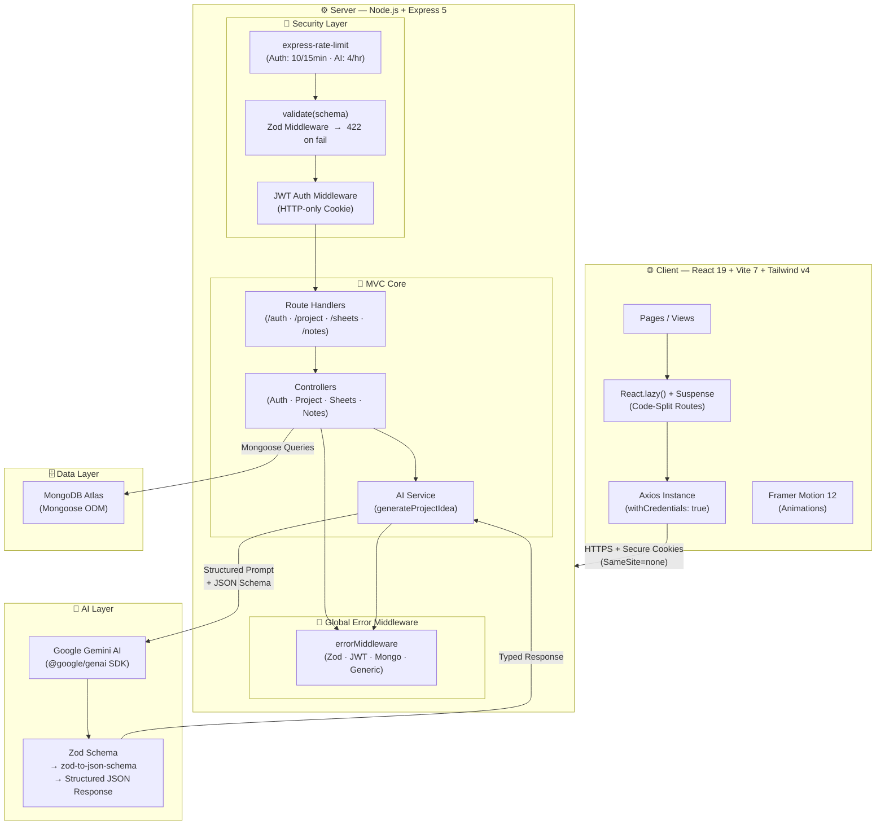
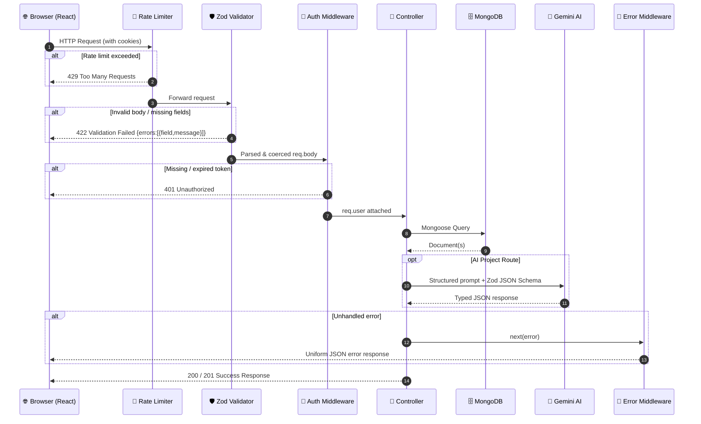
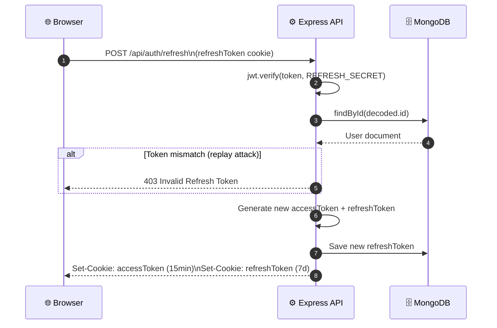
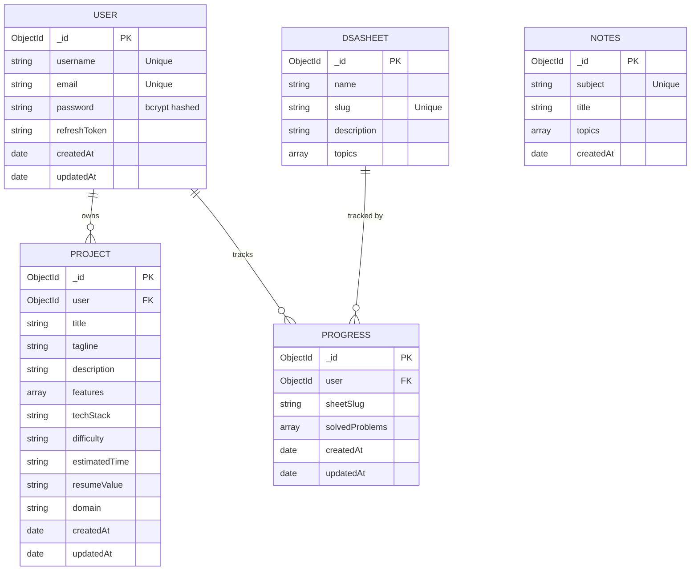

# PrepStack 🚀 <!-- omit in toc -->

<div align="center">

[](LICENSE)
[](https://github.com/SahilSameer18/prepstack/pulls)
[](https://react.dev/)
[](https://tailwindcss.com/)
[](https://expressjs.com/)
[](https://ai.google.dev/)
[](https://zod.dev/)

**A premium, full-stack SDE interview preparation ecosystem.**

[Live Demo](https://prepstack-ss.vercel.app) · [Report Bug](https://github.com/SahilSameer18/prepstack/issues) · [Request Feature](https://github.com/SahilSameer18/prepstack/issues)

</div>

---

PrepStack centralizes the entire SDE interview journey into one high-performance platform — **AI-driven project generation**, **curated DSA progress tracking**, **academic CS notes**, and **behavioral/STAR resume templates** — built with production-grade engineering practices.

---

## 📋 Table of Contents <!-- omit in toc -->

- [🎯 The Problem PrepStack Solves](#-the-problem-prepstack-solves)
- [⚡ High-Yield Technical Highlights](#-high-yield-technical-highlights)
- [🏗️ Architectural Blueprint](#️-architectural-blueprint)
- [✨ Core Features \& Business Value](#-core-features--business-value)
- [🛠️ Deep-Dive Tech Stack](#️-deep-dive-tech-stack)
- [💾 Database Schema ERD](#-database-schema-erd)
- [🔗 API Endpoint Reference](#-api-endpoint-reference)
- [🚀 Local Installation \& Seeding Guide](#-local-installation--seeding-guide)
- [💼 Available Scripts](#-available-scripts)
- [🤝 Contributing](#-contributing)
- [📄 License](#-license)

---

## 🎯 The Problem PrepStack Solves

Candidates typically scatter their preparation across multiple platforms — LeetCode for DSA, random blog posts for CS theory, ChatGPT for generic project ideas, and various PDFs for resume tips.

PrepStack centralizes and streamlines the entire workflow:

1. **Generates unique, startup-quality project ideas** using structured Gemini AI, complete with tech stacks and recruiter-ready resume bullet points.
2. **Tracks DSA problem-solving progress** across curated, industry-standard sheets (Striver A2Z, Blind75, NeetCode, Love Babbar) in a single clean dashboard.
3. **Prepares candidates for HR/Behavioral rounds** with interactive STAR templates, expert strategy notes, and searchable behavioral question banks.

---

## ⚡ High-Yield Technical Highlights

- **Type-Safe GenAI Pipelines:** Uses `zod-to-json-schema` to derive a strict JSON schema from Zod models, which is passed directly to the Gemini SDK. The model is constrained to emit only valid structured JSON — no fragile string parsing.
- **Layered Zod Validation:** All API routes are guarded by a reusable `validate(schema)` Express middleware. Input is parsed and coerced before it ever touches a controller — returning structured per-field `422` errors on failure.
- **Secure Session Architecture:** JWT session management via **HTTP-only `SameSite=none` cookies** prevents CSRF/XSS. A full **refresh token rotation flow** issues new access + refresh pairs on every `/refresh` call, with the server-stored token used for replay protection.
- **Cutting-Edge Stack:** React 19 (concurrent rendering), Vite 7 (HMR), Tailwind CSS v4 (new compiler), Express 5 (native async error propagation), Mongoose 9.
- **Global Error Handling:** A single centralized error middleware catches Zod errors, JWT errors, Mongoose duplicate key errors, and generic failures — producing uniform JSON error shapes across the whole API.
- **Route-Level Code Splitting:** React `lazy()` + Suspense boundaries lazy-load all heavy pages (DSA Sheets, Notes, Roadmaps, AI Projects, Resume, Behavioral, Dashboard), reducing initial bundle weight and improving Lighthouse scores.
- **Upsert-Safe Database Seeding:** `masterSeed.js` uses `findOneAndUpdate` with upsert to populate complex nested DSA sheets and CS notes schemas without duplication risk.

---

## 🏗️ Architectural Blueprint

### System Overview



---

### Request Lifecycle



---

### Token Refresh Flow



---

## ✨ Core Features & Business Value

### 🤖 AI-Powered Project Generation

- **Dynamic Prompting:** Candidates supply their target tech stack, complexity level (`beginner` / `intermediate` / `advanced`), domain (FinTech, EdTech, HealthTech, Web3), and custom notes.
- **Recruiter-Ready Output:** Gemini returns structured JSON containing project title, tagline, full description, feature list, difficulty rating, estimated time, and direct STAR-style resume bullet points.
- **Persistence:** Saved ideas are linked to user accounts via MongoDB for reference or deletion.
- **Rate-Limited:** Protected at 4 AI requests per hour per IP via `express-rate-limit`.

### 📈 Dynamic DSA Trackers

- Centralizes popular sheets: **Blind 75**, **NeetCode 150**, **Striver A2Z**, and **Love Babbar 450**.
- Asynchronously tracks solved problems with toggle completion, updating dashboard progress metrics instantly.
- Problems are categorized by topic (Arrays, Graphs, DP, etc.) with direct external compiler links.

### 📚 CS Core Fundamentals Library

- Pre-seeded revision notes for: **Operating Systems**, **Database Management Systems**, **Computer Networks**, and **Object-Oriented Programming**.
- Structured for fast session-style revision with markdown-rendered content.

### 📝 STAR Resume & Behavioral Console

- **Resume Guidelines:** Section-by-section breakdown of contact info, skills, experience, and projects with real-world examples.
- **Behavioral Hub:** Searchable bank of behavioral questions categorized by focus area — Teamwork, Leadership, Problem Solving, Personal Growth — with expert sample answers.

---

## 🛠️ Deep-Dive Tech Stack

### Frontend

| Technology | Version | Role |
|---|---|---|
| React | 19.2 | UI library (concurrent rendering) |
| Vite | 7 | Build tooling & HMR |
| Tailwind CSS | v4 | Utility-first styling (new compiler) |
| Framer Motion | 12 | Animations & transitions |
| React Router DOM | 7 | Client-side routing |
| Axios | latest | HTTP client with cookie interceptor |

### Backend

| Technology | Version | Role |
|---|---|---|
| Node.js + Express | 5.2 | Server framework (native async errors) |
| Mongoose | 9 | MongoDB ODM with strict schemas |
| Zod | 4 | Request validation + AI schema generation |
| zod-to-json-schema | 3 | Converts Zod schemas → Gemini JSON config |
| @google/genai | 1.47 | Official Gemini AI SDK |
| jsonwebtoken | 9 | JWT signing & verification |
| bcrypt | 6 | Secure password hashing (12 rounds) |
| cookie-parser | 1.4 | HTTP-only cookie parsing |
| express-rate-limit | 8.5 | API abuse protection |
| multer | 2 | File upload handling |

---

## 💾 Database Schema ERD



---

## 🔗 API Endpoint Reference

### Authentication — `/api/auth`

| Method | Endpoint | Auth | Description |
|---|---|---|---|
| `POST` | `/register` | — | Register new user *(rate-limited: 10/15min)* |
| `POST` | `/login` | — | Login + set JWT cookies *(rate-limited: 10/15min)* |
| `POST` | `/refresh` | Cookie | Rotate access + refresh token pair |
| `POST` | `/logout` | ✅ JWT | Clear cookies + invalidate refresh token |
| `GET` | `/current-user` | ✅ JWT | Fetch authenticated user profile |

### AI Projects — `/api/project`

| Method | Endpoint | Auth | Description |
|---|---|---|---|
| `POST` | `/generate` | ✅ JWT | Generate project idea via Gemini *(rate-limited: 4/hr)* |
| `GET` | `/` | ✅ JWT | List all saved project ideas |
| `GET` | `/:projectId` | ✅ JWT | Fetch a single project |
| `DELETE` | `/:projectId` | ✅ JWT | Delete a saved project |

### DSA Sheets — `/api/sheets`

| Method | Endpoint | Auth | Description |
|---|---|---|---|
| `GET` | `/` | — | List all DSA sheets |
| `GET` | `/:slug` | — | Get topics & problems for a sheet |
| `GET` | `/:slug/progress` | ✅ JWT | Get user's solved problems |
| `POST` | `/:slug/progress` | ✅ JWT | Toggle problem complete/incomplete |

### CS Notes — `/api/notes`

| Method | Endpoint | Auth | Description |
|---|---|---|---|
| `GET` | `/` | — | List all CS subject categories |
| `GET` | `/:subject` | — | Get detailed notes for a subject |

---

## 🚀 Local Installation & Seeding Guide

### 1. Clone Repository

```bash
git clone https://github.com/SahilSameer18/prepstack.git
cd prepstack
```

### 2. Backend Setup

```bash
cd server
npm install
```

Create a `.env` file inside `/server`:

```env
PORT=3000
MONGO_URI=mongodb://127.0.0.1:27017/prepstack
ACCESS_SECRET=your_ultra_secure_access_token_secret
REFRESH_SECRET=your_ultra_secure_refresh_token_secret
GOOGLE_API_KEY=AIzaSyYourGeminiApiKeyHere
```

Start the dev server:

```bash
npm run dev
```

### 3. Frontend Setup

Open a new terminal:

```bash
cd client
npm install
npm run dev
```

### 4. Seed the Database

Populate with complete DSA sheets and CS notes:

```bash
cd server
npm run seed:all
```

> **Note:** Seeder uses `findOneAndUpdate` upsert — safe to run multiple times without creating duplicate documents.

---

## 💼 Available Scripts

### Backend (`server/`)

| Script | Description |
|---|---|
| `npm run dev` | Start with Nodemon (auto-reload on change) |
| `npm start` | Start in production mode |
| `npm run seed:notes` | Seed CS notes (OS, DBMS, CN, OOP) |
| `npm run seed:all` | Seed all DSA sheets + CS notes |

### Frontend (`client/`)

| Script | Description |
|---|---|
| `npm run dev` | Start Vite dev server with HMR |
| `npm run build` | Compile production bundle |
| `npm run lint` | Run ESLint code quality check |
| `npm run preview` | Preview the production build locally |

---

## 🤝 Contributing

Contributions make the open-source community an amazing place to learn, inspire, and create. All contributions are **greatly appreciated**.

1. Fork the Project
2. Create your Feature Branch (`git checkout -b feature/AmazingFeature`)
3. Commit your Changes (`git commit -m 'Add some AmazingFeature'`)
4. Push to the Branch (`git push origin feature/AmazingFeature`)
5. Open a Pull Request

---

## 📄 License

Distributed under the MIT License. See `LICENSE` for more information.

---

<p align="center">Made with ❤️ by Sahil Sameer and the PrepStack Team.</p>
